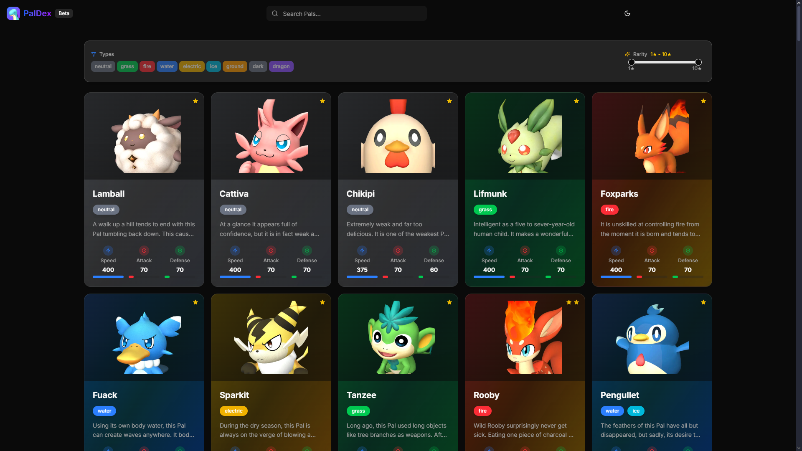

<h1 align="center">
  
</h1>

<h3 align="center">
  Palworld Paldex WebSite
</h3>
<h6 align="center"><i></i></h6>

<p align="center">
  <a href="https://github.com/PedroRBC/paldex/issues">
    
  </a>

  
</p>

# PalDex

A modern web application for exploring and discovering Pals in the Palworld universe. Built with Next.js 14, TypeScript, and Tailwind CSS.



## Features

- 🎮 Browse all Pals with detailed information
- 🔍 Search and filter Pals by name, type, and rarity
- 📱 Responsive design for all devices
- 🎨 Beautiful UI with theme support
- ⚡ Fast and efficient client-side filtering
- 📊 Detailed stats and information for each Pal
- 🎯 Type-specific color coding
- 🔄 Real-time search and filtering

## Tech Stack

- [Next.js 14](https://nextjs.org/) - React framework
- [TypeScript](https://www.typescriptlang.org/) - Type safety
- [Tailwind CSS](https://tailwindcss.com/) - Styling
- [shadcn/ui](https://ui.shadcn.com/) - UI components
- [Lucide Icons](https://lucide.dev/) - Icons

## Getting Started

### Prerequisites

- Node.js 18+ or Bun 1.0+
- Git

### Installation

1. Clone the repository:
```bash
git clone https://github.com/PedroRBC/paldex.git
cd paldex
```

2. Install dependencies:
```bash
# Using npm
npm install

# Using Bun
bun install
```

3. Start the development server:
```bash
# Using npm
npm run dev

# Using Bun
bun dev
```

4. Open [http://localhost:3000](http://localhost:3000) in your browser.

## Development

### Project Structure

```
paldex/
├── src/
│   ├── app/              # Next.js app directory
│   ├── components/       # React components
│   ├── lib/             # Utility functions
│   ├── services/        # API services
│   └── types/           # TypeScript types
└── ...
```

### Available Scripts

- `dev` - Start development server
- `build` - Build for production
- `start` - Start production server
- `lint` - Run ESLint
- `type-check` - Run TypeScript type checking

## Contributing

1. Fork the repository
2. Create your feature branch (`git checkout -b feature/amazing-feature`)
3. Commit your changes (`git commit -m 'Add some amazing feature'`)
4. Push to the branch (`git push origin feature/amazing-feature`)
5. Open a Pull Request

## License

This project is licensed under the MIT License - see the [LICENSE](LICENSE) file for details.

## Acknowledgments

- [Palworld](https://www.palworld.net/) - The game that inspired this project
- [Palworld Wiki](https://palworld.fandom.com/) - For the Pal information
- [Next.js](https://nextjs.org/) - The React framework used
- [shadcn/ui](https://ui.shadcn.com/) - For the beautiful UI components
